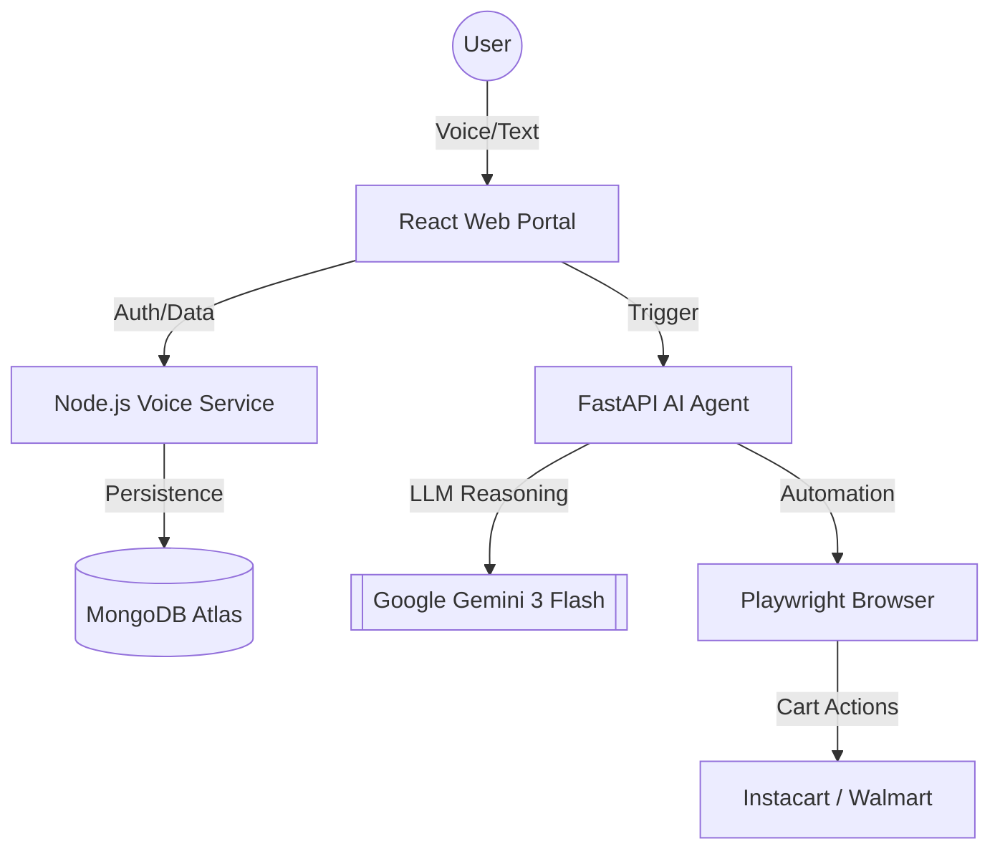

# 🛒 Florland AI Grocery Assistant (Enterprise Edition)

**Florland** is a state-of-the-art, AI-driven grocery shopping automation platform. It bridges the gap between natural language (voice/text) and autonomous e-commerce actions, allowing users to build lists and have an AI agent fill their carts on major vendor sites like Instacart and Walmart.

---

## 🏛️ System Architecture

---

## 🛠️ Core Pillars of Implementation

### 1. The Intelligence Engine (Pillar 1)
- **Natural Language Parsing**: Uses **Gemini 3 Flash** to understand messy voice inputs (e.g., "Get me some milk, 2 packs of organic eggs, and a large bag of chips").
- **Structured Specification**: Converts input into a Pydantic-compliant JSON object containing:
  - `item_name`: Optimized search query.
  - `quantity`: Numerical value.
  - `category`: Groceries, Pharmacy, etc.
  - `brand_preference`: If mentioned.

### 2. Autonomous Browser Agent (Pillar 2)
- **Human-Like Interaction**: Implements randomized delays, organic scrolling, and unique viewport offsets to avoid bot detection.
- **Dynamic Popup Handling**: Automatically manages location prompts, cookie consent, and promotional overlays.
- **Interactive Recovery**: Detects Captchas and login walls, pausing execution and notifying the user for "Human-in-the-Loop" intervention.

### 3. Professional Frontend & UX (Pillar 3)
- **Multi-Stage Store Selection**: Intuitive selection of parent vendors (Instacart) and sub-stores (Publix, Aldi, Costco).
- **Guided Handover**: A dedicated UI dialog that manages the transition between the AI portal and the vendor site.
- **History & Analytics**: Persistent dashboard to review past shopping sessions with itemized snapshots.

---

## 🔌 API Reference

### Voice Service (Node.js - Port 3001)
| Endpoint | Method | Description |
| :--- | :--- | :--- |
| `/api/auth/register` | POST | User registration |
| `/api/config/vendors` | GET | Fetch available stores & sub-stores |
| `/api/sessions` | POST | Create a new shopping history entry |
| `/api/sessions/history` | GET | Retrieve user shopping history |

### AI Automation Service (FastAPI - Port 8000)
| Endpoint | Method | Description |
| :--- | :--- | :--- |
| `/agent/checkout` | POST | Triggers the Playwright AI shopping agent |
| `/agent/status` | GET | Real-time polling for automation progress |

---

## ⚙️ Installation & Configuration

### Prerequisites
- Node.js (v18+)
- Python (v3.10+)
- MongoDB Atlas Account
- Google Gemini API Key

### Environment Setup
Create a `.env` file in each backend directory using the provided `.env.example` templates.

**Important Keys:**
- `MONGODB_URI`: Your database connection string.
- `GEMINI_API_KEY`: Required for the Intelligence Engine.
- `JWT_SECRET`: For secure user authentication.

### Running the Services
1. **Start MongoDB & Node Backend**: `cd backend/voice_service && npm run dev`
2. **Start AI Automation Service**: `cd backend/ai_service && python main.py`
3. **Launch Web Portal**: `cd frontend && npm run dev`

---

## 🛡️ Stealth & Reliability Features
- **Headless Toggle**: Can run in headless mode for speed or headed mode for debugging.
- **Action Required Alerts**: Frontend notifies user if a Captcha is detected.
- **Session Snapshots**: Items are saved before redirection to ensure data persistence even if the tab is closed.

---

## 🗺️ Roadmap
- [x] Phase 1: Core Foundation & Landing Template
- [x] Phase 2: Affiliate Routing Engine
- [x] Phase 3: AI Intelligence & Automation
- [x] Phase 4: Diagram Alignment & Persistence
- [x] Phase 5: Analytics Dashboard & Reliability
- [ ] Phase 6: Production Deployment (Docker)

---

## 🤝 Project Credits
Developed for **Florland AI** by the **Advanced Engineering Team**.
Contact: [Ahmad Hassan](https://github.com/AHMADHASSANRAFIQUE)
